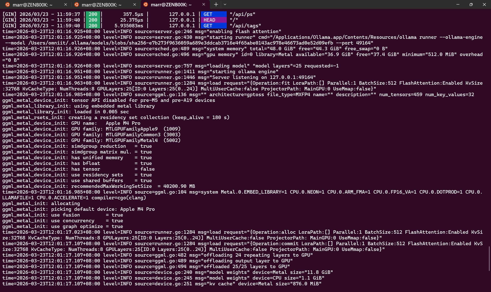

# WSL
確認 ollama 成功執行
```
$ grep ExecStart /etc/systemd/system/ollama.service
ExecStart=/usr/local/bin/ollama serve

$ ps aux | grep ollama
ollama     32448  0.0  0.2 1862248 45984 ?       Ssl  01:46   0:01 /usr/local/bin/ollama serve
```

確認 prompt 成功回應
```
$ curl http://localhost:11434/api/generate \
  -d '{
    "model": "minimax-m2.5",
    "prompt": "Hello! Can you give me a quick summary of what minimax is?"
  }'
{"error":"model 'minimax-m2.5' not found"}

$ curl http://localhost:11434/api/generate \
  -d '{
    "model": "minimax-m2.5:cloud",
    "prompt": "Hello! Can you give me a quick summary of what minimax is?"
  }'
{"model":"minimax-m2.5:cloud","remote_model":"minimax-m2.5","remote_host":"https://ollama.com:443","created_at":"2026-02-24T01:51:49.106945424Z","response":"","thinking":"The user","done":false}
{"model":"minimax-m2.5:cloud","remote_model":"minimax-m2.5","remote_host":"https://ollama.com:443","created_at":"2026-02-24T01:51:49.558857859Z","response":"","thinking":" is asking about \"minimax\" - this could refer to a few different things:\n\n1. **Minimax (","done":false}
{"model":"minimax-m2.5:cloud","remote_model":"minimax-m2.5","remote_host":"https://ollama.com:443","created_at":"2026-02-24T01:51:49.572735223Z","response":"","thinking":"company)** - A Chinese AI company that developed the abab model series\n2. **Minimax algorithm** - A","done":false}
{"model":"minimax-m2.5:cloud","remote_model":"minimax-m2.5","remote_host":"https://ollama.com:443","created_at":"2026-02-24T01:51:49.620034768Z","response":"","thinking":" decision-making algorithm used in game theory and AI\n3. **Minimax (software/tool)** - Could refer to various","done":false}
{"model":"minimax-m2.5:cloud","remote_model":"minimax-m2.5","remote_host":"https://ollama.com:443","created_at":"2026-02-24T01:51:50.084098049Z","response":"","thinking":" software products\n\nGiven that this is the context of chatting with MiniMax (the AI assistant), I should clarify what the user is","done":false}
{"model":"minimax-m2.5:cloud","remote_model":"minimax-m2.5","remote_host":"https://ollama.com:443","created_at":"2026-02-24T01:51:52.204178865Z","response":"","thinking":" asking about. Since the user might be referring to the AI assistant they're currently talking to, I should explain that Minim","done":false}
{"model":"minimax-m2.5:cloud","remote_model":"minimax-m2.5","remote_host":"https://ollama.com:443","created_at":"2026-02-24T01:51:52.930836515Z","response":"","thinking":"ax is an AI company that created me.\n\nLet me provide a helpful response that covers the main interpretations but focuses on the AI","done":false}
{"model":"minimax-m2.5:cloud","remote_model":"minimax-m2.5","remote_host":"https://ollama.com:443","created_at":"2026-02-24T01:51:53.632334721Z","response":"","thinking":" company context since that's most relevant here.","done":false}
{"model":"minimax-m2.5:cloud","remote_model":"minimax-m2.5","remote_host":"https://ollama.com:443","created_at":"2026-02-24T01:51:53.632493049Z","response":"# Minimax\n\nMinimax is an **AI","done":false}
{"model":"minimax-m2.5:cloud","remote_model":"minimax-m2.5","remote_host":"https://ollama.com:443","created_at":"2026-02-24T01:51:54.535868241Z","response":" company** based in China that specializes in developing large language models (LLMs) and AI applications. Here are the key points:\n\n## What They Do\n- **","done":false}
{"model":"minimax-m2.5:cloud","remote_model":"minimax-m2.5","remote_host":"https://ollama.com:443","created_at":"2026-02-24T01:51:55.224643515Z","response":"Founded** in 2021 by a team including former Baidu researchers\n- Developed the **abab model","done":false}
{"model":"minimax-m2.5:cloud","remote_model":"minimax-m2.5","remote_host":"https://ollama.com:443","created_at":"2026-02-24T01:51:55.870046249Z","response":" series** (abab 5, abab 5.5, etc.)\n- Focus on both research and commercial","done":false}
{"model":"minimax-m2.5:cloud","remote_model":"minimax-m2.5","remote_host":"https://ollama.com:443","created_at":"2026-02-24T01:51:56.472191131Z","response":" AI products\n\n## Products \u0026 Services\n- **MiniMax Chat** - AI chatbot","done":false}
{"model":"minimax-m2.5:cloud","remote_model":"minimax-m2.5","remote_host":"https://ollama.com:443","created_at":"2026-02-24T01:51:57.029164765Z","response":" similar to ChatGPT\n- **Kobold** - AI-powered gaming platform\n- Enterprise","done":false}
{"model":"minimax-m2.5:cloud","remote_model":"minimax-m2.5","remote_host":"https://ollama.com:443","created_at":"2026-02-24T01:51:57.622242885Z","response":" AI solutions\n- API services for developers\n\n## Key Features\n- Strong in multilingual AI capabilities\n- Focus on reasoning","done":false}
{"model":"minimax-m2.5:cloud","remote_model":"minimax-m2.5","remote_host":"https://ollama.com:443","created_at":"2026-02-24T01:51:58.145080503Z","response":" and coding abilities\n- Open-source some models (like abab 5.5)\n\n---\n\nAre you asking","done":false}
{"model":"minimax-m2.5:cloud","remote_model":"minimax-m2.5","remote_host":"https://ollama.com:443","created_at":"2026-02-24T01:51:58.682326481Z","response":" about:\n1. Minimax the AI company (which created me! 👋)\n2. The minimax algorithm (","done":false}
{"model":"minimax-m2.5:cloud","remote_model":"minimax-m2.5","remote_host":"https://ollama.com:443","created_at":"2026-02-24T01:51:59.256353676Z","response":"game theory/AI concept)\n3. Something else?\n\nLet me know and I can provide more specific details!","done":false}
{"model":"minimax-m2.5:cloud","remote_model":"minimax-m2.5","remote_host":"https://ollama.com:443","created_at":"2026-02-24T01:51:59.260522453Z","response":"","done":false}
{"model":"minimax-m2.5:cloud","remote_model":"minimax-m2.5","remote_host":"https://ollama.com:443","created_at":"2026-02-24T01:51:59.309664628Z","response":"","done":true,"done_reason":"stop","total_duration":12316299237,"prompt_eval_count":56,"eval_count":376}
```

更換 IP 設定
```
export OLLAMA_HOST=192.168.117.161:11434
```
# MacMini4

```
term1% ps aux | grep ollama
term1% ollama serve
time=2026-03-23T11:57:09.148+08:00 level=INFO source=routes.go:1727 msg="server config" env="map[HTTPS_PROXY: HTTP_PROXY: NO_PROXY: OLLAMA_CONTEXT_LENGTH:0 OLLAMA_DEBUG:INFO OLLAMA_EDITOR: OLLAMA_FLASH_ATTENTION:false OLLAMA_GPU_OVERHEAD:0 OLLAMA_HOST:http://127.0.0.1:11434 OLLAMA_KEEP_ALIVE:5m0s OLLAMA_KV_CACHE_TYPE: OLLAMA_LLM_LIBRARY: OLLAMA_LOAD_TIMEOUT:5m0s OLLAMA_MAX_LOADED_MODELS:0 OLLAMA_MAX_QUEUE:512 OLLAMA_MODELS:/Users/omniit/.ollama/models OLLAMA_MULTIUSER_CACHE:false OLLAMA_NEW_ENGINE:false OLLAMA_NOHISTORY:false OLLAMA_NOPRUNE:false OLLAMA_NO_CLOUD:false OLLAMA_NUM_PARALLEL:1 OLLAMA_ORIGINS:[http://localhost https://localhost http://localhost:* https://localhost:* http://127.0.0.1 https://127.0.0.1 http://127.0.0.1:* https://127.0.0.1:* http://0.0.0.0 https://0.0.0.0 http://0.0.0.0:* https://0.0.0.0:* app://* file://* tauri://* vscode-webview://* vscode-file://*] OLLAMA_REMOTES:[ollama.com] OLLAMA_SCHED_SPREAD:false http_proxy: https_proxy: no_proxy:]"
time=2026-03-23T11:57:09.148+08:00 level=INFO source=routes.go:1729 msg="Ollama cloud disabled: false"
time=2026-03-23T11:57:09.150+08:00 level=INFO source=images.go:477 msg="total blobs: 25"
time=2026-03-23T11:57:09.150+08:00 level=INFO source=images.go:484 msg="total unused blobs removed: 0"
time=2026-03-23T11:57:09.151+08:00 level=INFO source=routes.go:1782 msg="Listening on 127.0.0.1:11434 (version 0.18.0)"
time=2026-03-23T11:57:09.151+08:00 level=INFO source=runner.go:67 msg="discovering available GPUs..."
time=2026-03-23T11:57:09.152+08:00 level=INFO source=server.go:430 msg="starting runner" cmd="/Applications/Ollama.app/Contents/Resources/ollama runner --ollama-engine --port 49156"
time=2026-03-23T11:57:09.211+08:00 level=INFO source=types.go:42 msg="inference compute" id=0 filter_id=0 library=Metal compute=0.0 name=Metal description="Apple M4 Pro" libdirs="" driver=0.0 pci_id="" type=discrete total="37.4 GiB" available="37.4 GiB"
time=2026-03-23T11:57:09.211+08:00 level=INFO source=routes.go:1832 msg="vram-based default context" total_vram="37.4 GiB" default_num_ctx=32768

term2% curl http://localhost:11434/api/generate \
  -d '{
    "model": "gpt-oss:20b",
    "prompt": "What is your model?"
  }'
{"model":"gpt-oss:20b","created_at":"2026-03-23T04:01:22.68395Z","response":"","done":true,"done_reason":"stop","context":[200006,17360,200008,3575,553,17554,162016,11,261,4410,6439,2359,22203,656,7788,17527,558,87447,100594,25,220,1323,19,12,3218,198,6576,3521,25,220,1323,21,12,3659,12,1860,279,30377,289,25,14093,279,2,13888,18403,25,8450,11,49159,11,1721,13,21030,2804,413,7360,395,1753,3176,13,200007,200006,1428,200008,4827,382,634,2359,30,200007,200006,173781,200005,35644,200008,976,1825,31064,25,392,4827,382,634,2359,16842,52762,1151,1023,1682,316,1761,290,27899,2359,328,17554,162016,13,623,6145,6052,25,357,939,17554,162016,11,4122,402,174803,12,19,24022,13,18057,9570,44041,13,54458,8633,3926,11,23736,13,63659,3357,82463,13,200007,200006,173781,200005,17196,200008,40,4572,34643,656,7788,17527,802,174803,50005,19,24022,350,3086,966,14065,162016,50005,19,693,2359,741,1328,2359,382,261,4410,91999,75019,6439,2359,22203,402,261,15174,9762,328,2201,326,1236,7493,11,50239,395,153459,13638,13],"total_duration":5973176709,"load_duration":3409109542,"prompt_eval_count":72,"prompt_eval_duration":347428958,"eval_count":109,"eval_duration":2141209880}
```


